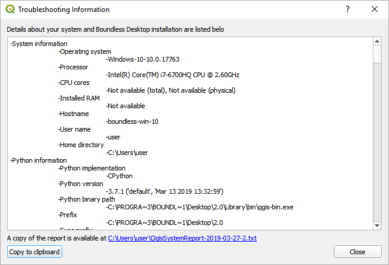
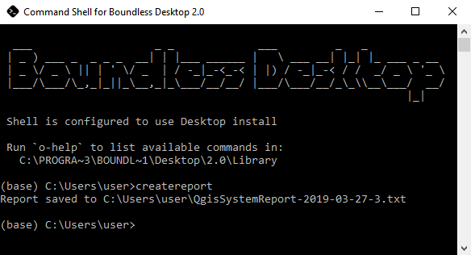

.. _asking_for_support:

How to ask for support
======================

  At Boundless we have prepared two options for getting assistance with
  Boundless Desktop:

* **Questions and Answers**: a crowdsourced forum system available to any
  Boundless Desktop user. You can ask questions and receive answers from a
  community of users and Boundless staff. Go to `Questions and Answers
  <https://connect.boundlessgeo.com/Community/Questions-Answers>`_.

* **Support tickets**: available only for organization-wide enterprise
  subscribers. You will get direct help from Boundless dedicated support staff
  that, together with the development team, will search for a solution to your
  issue.  If you do not have a subscription and are interested in learning more,
  please email us at contact@boundlessgeo.com.

.. _reporting_tool:

Support tool
------------

In either case, before you reach out for support, it's crucial that you
can provide enough information about the problem that you are facing
and about your system setup.

For that reason, we have created the *Support tool* library and QGIS plugin
that helps you with the task of collecting information about your QGIS
configuration and Operating System.

Usage
.....

If your problem does not affect QGIS launching, then the most convenient
way of using the Report tool is using it from QGIS.

#. From Boundless Desktop folder, open the :program:`QGIS`.

#. In QGIS menus, click :menuselection:`Plugins --> Boundless Support Tool`.

A new dialog will open with the full report visible, and the location of the
saved copy.

If the issue you are facing is not letting QGIS launch correctly, then you
may need to run the Reporting tool from the command line.

#. From Boundless Desktop folder, open the :program:`Command Shell`.

#. In the command line type the following command and press ENTER.

   ::

     createreport

The tool will save a report and inform you where it was saved.

.. note::

   We advice you to review the report before sending it to someone else, as
   the report may contain confidential information that you are not willing to
   share.
