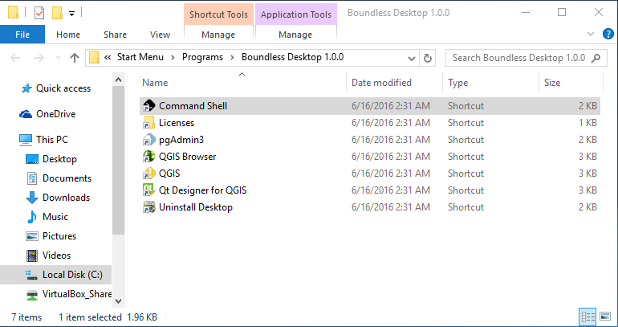

.. _components.gdal_ogr:

GDAL/OGR
========

About
-----

Geospatial Data Abstraction Library (GDAL/OGR) is a cross-platform C++ translator library for raster and vector geospatial data formats that is released under an X/MIT style Open Source license by the `Open Source Geospatial Foundation <http://www.osgeo.org>`_. As a library, it presents a single abstract data model to the calling application for all supported formats. It also comes with a variety of useful command line utilities for data translation and processing. GDAL supports over 50 raster formats, and OGR over 20 vector formats.

In Boundless Desktop installation, GDAL/OGR utilities are available through QGIS or the installed Command Shell. The shipped version of GDAL/OGR includes two extra libraries, LibKML and OpenJPEG2, for .kmz and JPEG2000 support, respectively.

Quick start guide
-----------------

:program:`GDAL/OGR` is a suite of command line programs that can be launched through the
:program:`Command Shell`.
:program:`Command Shell` can be found in the :guilabel:`Boundless Desktop` folder.

#. Download the data for this quick start :download:`here <data/events_data_sample.zip>` and unzip it anywhere you think it's convenient.

#. Open :program:`Command Shell` using any of the available shortcuts in your computer.

#. If you are on Windows, you will immediately see the list of available commands. 
   To list them again, type ``o-help`` and press :kbd:`Enter`.
   To print the list of available commands on Mac, type ``list-cmds`` and press :kbd:`Enter`.

#. To execute a :program:`GDAL/OGR` command, type its name an press enter.
   If executed without arguments :program:`GDAL/OGR` commands normally print
   a short help text that can also be accessed with `--help` option, for example::

       gdalinfo --help

   .. figure::   img/desktop_command_shell_gdalinfo.png

#. To print all information on the shapefile `events.shp` contained in the
   sample data, navigate to the location of the unzipped quick start data and run the following::

       ogrinfo -al events.shp

   The output of the command is::

       INFO: Open of `events.shp'
             using driver `ESRI Shapefile' successful.
       
       Layer name: events
       Geometry: Point
       Feature Count: 1
       Extent: (7.123115, 50.718396) - (7.123115, 50.718396)
       Layer SRS WKT:
       GEOGCS["GCS_WGS_1984",
           DATUM["WGS_1984",
               SPHEROID["WGS_84",6378137,298.257223563]],
           PRIMEM["Greenwich",0],
           UNIT["Degree",0.017453292519943295]]
       name: String (80.0)
       venue: String (80.0)
       start_date: Date (10.0)
       end_date: Date (10.0)
       OGRFeature(events):0
         name (String) = FOSS4G 2016
         venue (String) = World Conference Center Bonn
         start_date (Date) = 2016/08/21
         end_date (Date) = 2016/08/26
         POINT (7.12311523114681 50.718396029588526)

#. To convert the shapefile `events.shp` to a different coordinate reference
   system (UTM 33N) and save it to a different format (MapInfo) you can use
   :program:`ogr2ogr`::

       ogr2ogr -t_srs EPSG:32633 -f "MapInfo File" events_32633.tab events.shp

#. To check the transformed data you can use :command:`ogrinfo`::

        ogrinfo -al events_32633.tab

   The output of the command is::

       Had to open data source read-only.
       INFO: Open of `events_32633.tab'
             using driver `MapInfo File' successful.
       
       Layer name: events_32633
       Geometry: Point
       Feature Count: 1
       Extent: (-55706.115697, 5648162.052998) - (-55706.115697, 5648162.052998)
       Layer SRS WKT:
       PROJCS["unnamed",
           GEOGCS["unnamed",
               DATUM["WGS_1984",
                   SPHEROID["WGS 84",6378137,298.257223563],
                   TOWGS84[0,0,0,0,0,0,0]],
               PRIMEM["Greenwich",0],
               UNIT["degree",0.0174532925199433]],
           PROJECTION["Transverse_Mercator"],
           PARAMETER["latitude_of_origin",0],
           PARAMETER["central_meridian",15],
           PARAMETER["scale_factor",0.9996],
           PARAMETER["false_easting",500000],
           PARAMETER["false_northing",0],
           UNIT["Meter",1.0]]
       name: String (80.0)
       venue: String (80.0)
       start_date: Date (10.0)
       end_date: Date (10.0)
       OGRFeature(events_32633):1
         name (String) = FOSS4G 2016
         venue (String) = World Conference Center Bonn
         start_date (Date) = 2016/08/21
         end_date (Date) = 2016/08/26
         Style = SYMBOL(a:0,c:#000000,s:12pt,id:"mapinfo-sym-35,ogr-sym-10")
         POINT (-55706.115697181601718 5648162.052997644990683)

Online resources
----------------

* Official Site: `<http://www.gdal.org/>`_
* GDAL Raster Utilities: `<http://www.gdal.org/gdal_utilities.html>`_
* OGR Vector Utilities: `<http://www.gdal.org/ogr_utilities.html>`_
