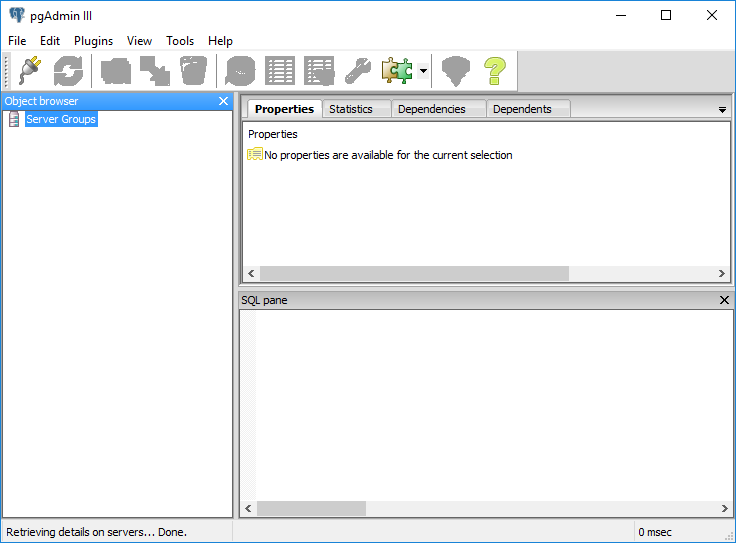
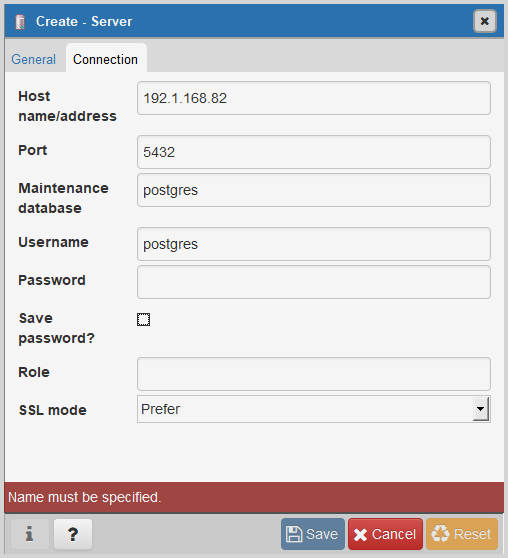
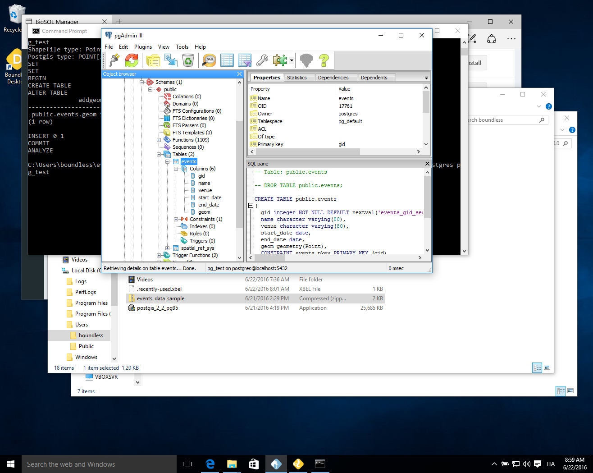
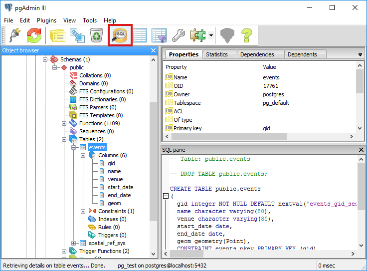
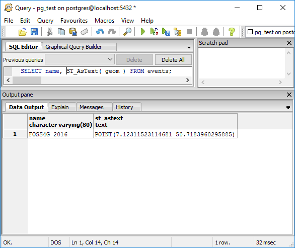
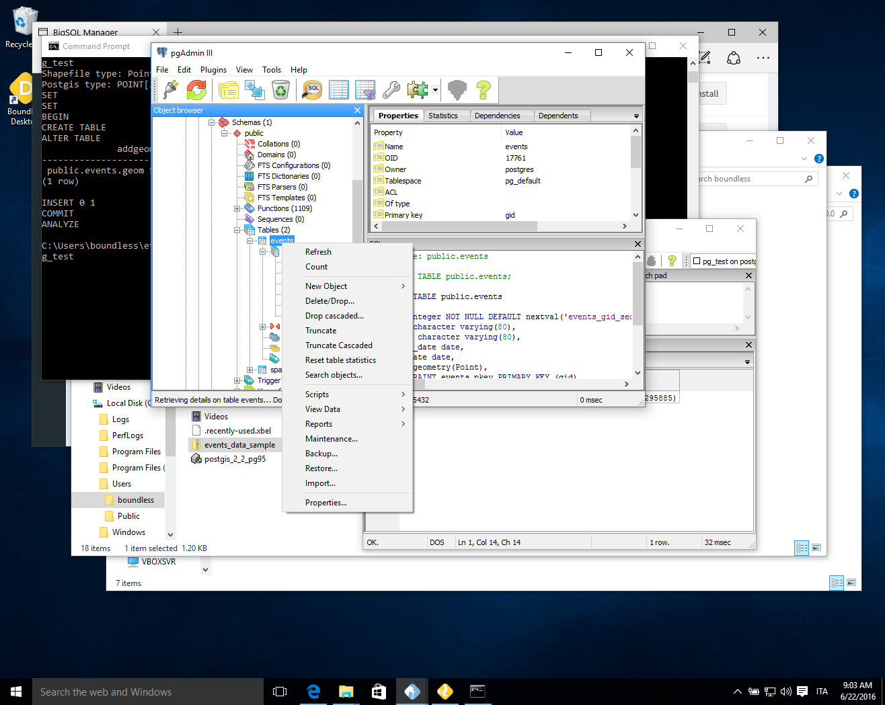

.. _components.pgadmin:

pgAdmin
=======

About
-----

`pgAdmin` is a feature rich Open Source administration and development platform for `PostgreSQL <https://www.postgresql.org/>`_, the most advanced Open Source database in the world, which includes, among others, the `Postgis <http://postgis.org/>`_ spatial extention.

`pgAdmin` is developed by a community of PostgreSQL experts around the world and is available in more than a dozen languages. It is Free Software released under the PostgreSQL License.

`pgAdmin` is aimed to answer the needs of all users, from writing simple SQL queries to developing complex databases. The graphical interface supports all PostgreSQL features and makes its administration easy. The application includes, among other things: syntax highlighting SQL editor, a server-side code editor, an SQL/batch/shell job scheduling agent, and much more. See more about it in the `official website <www.pgadmin.org>`_.

Quick start guide
-----------------

.. note::

    To execute this Quick Start Guide you will need a running instance of :program:`PostgreSQL` database
    with the spatial extension :program:`PostGIS` installed, please ask your system administrator
    for the connection parameters. For further information about :program:`PostgreSQL` or :program:`PostGIS`
    see :ref:`pgadmin.online_resources`.

The following quick start guide will introduce you to :program:`pgAdmin` basics. It will show how to access to a
spatially enabled database and run some simple queries on its tables.

0. Download the data for this tutorial :download:`here <data/events_data_sample.zip>` and unzip it anywhere you think it's convenient.

1. Import the geodata from the shapefile into the database, if you have :command:`shp2pgsql` command line utility
   at hand you can import the data with::

     shp2pgsql events.shp | psql -U postgres pg_test

   If you don't have this command available you can still use :program:`QGIS` *db manager*
   to import you data into the database.

2. Open :program:`pgAdmin` using any of the available shortcuts in your computer.

By default, :program:`pgAdmin` will show the following window on opening:

3. Click on the :guilabel:`plug` icon to create a new database connection.

4. Enter the connection parameters in the dialog, a database connection is usually
   identified by:

* host
* port
* username
* password

5. Click on the newly added server to open its features tree and select the `events` table or any other table you want to query

6. Click on the :guilabel:`SQL` icon

7. Execute a spatial query::

    SELECT name, St_AsText( geom ) FROM events;

8. Perform operations on selected tables with :kbd:`Right-Click`

.. _pgadmin.online_resources:

Online resources
----------------

* Official Site: `<www.pgadmin.org>`_
* Documentation: `<https://www.pgadmin.org/docs/1.22/index.html>`_
* :program:`PostgreSQL` `<https://www.postgresql.org>`_
* :program:`PostGIS` `<http://postgis.net>`_
