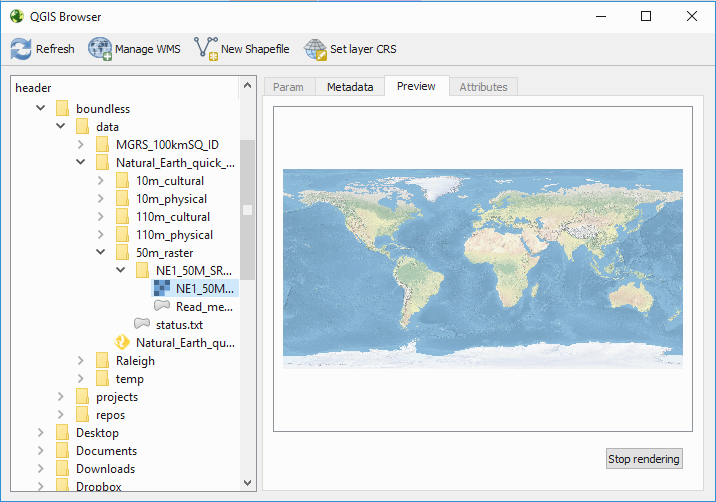

.. _components.qgis:

QGIS
====

About
-----

QGIS is the central piece of the Boundless Desktop package installation. The
well known leading Open Source GIS for desktop, QGIS, is a cross-platform
desktop application for viewing, editing, and analysing geospatial data from a
variety of (proprietary and open) vector, raster, and database formats.

QGIS’s development is steered by the `QGIS Project <www.qgis.org>`_, which works
with hundreds of volunteers and companies (including Boundless) from all over
the world, that helps enhance and maintain QGIS.

For convenience, outside the supported scope of Boundless Desktop, the following
processing providers are available for QGIS’s Processing framework:

* SAGA 2.3 by `<http://www.saga-gis.org>`_
* GRASS 7.2 by `<http://grass.osgeo.org>`_
* Orfeo Toolbox 5.0 by `<https://www.orfeo-toolbox.org>`_

.. _components.qgis.quickstart:

Quick start guide
-----------------

This section aims to give you a brief overview about QGIS. We will mainly focus
on QGIS's graphical user interface (GUI) and some of the most common operations
like loading data, managing layers and printing a map. For more detailed
information on QGIS usage see the tutorials on our learning centre and/or
consult QGIS's official `documentation
<http://docs.qgis.org/2.14/en/docs/index.html>`_.

For this Quick start, we will be using the `Natural Earth
<http://www.naturalearthdata.com>`_ data. Please, download `Natural Earth
Quickstart Kit
<http://naciscdn.org/naturalearth/packages/Natural_Earth_quick_start.zip>`_ and
unzip it to any folder that you find convenient to access.

QGIS user interface
~~~~~~~~~~~~~~~~~~~

#. Use any of the available QGIS's shortcuts on your computer to open QGIS.

   By default, the QGIS GUI should resemble the one presented in the next figure.
   
   .. figure:: img/qgis_GUI.png
   
      QGIS Graphical User Interface (GUI)
   
   As a very basic overview of the default GUI we have:
   
   * On the top of the screen you will find the menu bar (1). The menu bar
     provides access to various QGIS features using a standard hierarchical
     menu.

   * Below it, you will find the main toolbar area (2). Toolbars allow access to
     most of the same functions as the menus, plus additional tools for
     interacting with the map. Hold your mouse over the item for a short
     description of the tool's purpose. Toolbars can be moved by dragging and
     dropping them elsewhere and even hidden using :menuselection:`View -->
     Toolbars`.

   * Another toolbar can be found at the left side of the screen (3). By
     default, the :guilabel:`Manage Layers Toolbar` is placed there. This
     toolbar can be used to load and create data, as we will see later.

   * Next to it, there are two Panels by default: The :guilabel:`Browser Panel`
     (4), which is used to browse and load data, and the :guilabel:`Layers
     Panel` (5) which is used to toggle layers visibility, setting their
     relative order, accessing the layer's properties and much more. Panels
     can also be moved by drag and drop, or even hidden using :guilabel:`View
     --> Panels`.

   * To the right and middle of the screen, you find the map canvas (6) where
     all visible layers' geometries will be displayed.

   * At the bottom of the screen you will find the status bar (7) with
     several useful information and controls for the current map scale, the
     mouse pointer coordinates, the current Coordinate Reference System's
     EPSG code in use, and more.

Loading data
~~~~~~~~~~~~

In QGIS, to load data, you can either use the :guilabel:`Browser Panel`, the
:guilabel:`Manage Layers Panel` or even use your operating system file explorer.

#. Using the :guilabel:`Browser Panel`, browse to the sample data location,
   more precisely into the ``Natural_Earth_quick_start\10m_physical`` folder.
   Double-click the folder's names or click the plus signs next to it to view
   its contents. Find the ``ne_10m_coastline.shp`` shapefile and drag and
   drop it from the browser to the map canvas. It will load the vector layer.

   .. figure:: img/qgis_dragndrop_from_browser.png
   
      Loading a layer using the Browser Panel
   
   The layer should now be visible on the map canvas, using a random style.
   It should also be visible in the :guilabel:`Layers Panel` list.
   
   .. figure:: img/qgis_loaded_layer.png
   
      Successfully loaded layer

#. Let's open another file, this time using the :guilabel:`Manage Layers
   toolbar` buttons. Notice that there is one button for each type of dataset,
   so we should select the most suitable one. Click on the :guilabel:`Add
   Raster Layer`. Then, navigate ito the folder
   ``Natural_Earth_quick_start\50m_raster\NE1_50M_SR_W``, select the
   ``NE1_50M_SR_W.tif`` file and click :guilabel:`Open`.
   
   .. figure:: img/qgis_loading_raster.png
   
      Loading a layer using Add Raster Layer

#. Finally, let's open an ESRI fileGeodatabase, just because it has a small
   catch. In the guilabel:`Manage Layers toolbar` click the :guilabel:`Add
   Vector Layer`. In the next dialog, under :guilabel:`Source type` check the
   ``Directory`` option. Then, making sure that :guilabel:`Type` is set to
   ``ESRI FileGDB``, use the :guilabel:`Browse` button to navigate and select
   the ``Natural_Earth_quick_start\10m_cultural
   \ne_10m_admin_1_states_provinces_geodb.gdb`` folder. Click
   :guilabel:`choose`. Finally, back in the dialog window, click
   :guilabel:`Open` to load the layer.

   .. figure:: img/qgis_loading_filegeodatabase.png
   
      Loading an ESRI FileGeodataBase layer using Add Vector Layer

#. Feel free to add any other data, but bare in mind that you can load
   several files at once by holding the :kbd:`Ctrl` key during file selection
   in any of the two described methods. Also, you can drag and drop files from
   your operating system's file manager (Windows Explorer in Windows or
   Finder in Mac OS X) into QGIS Map canvas to load them.

Navigating in the map canvas
~~~~~~~~~~~~~~~~~~~~~~~~~~~~

To navigate the map canvas you can primarily use your mouse wheel. For more
precise control over the map canvas, you can also use the :guilabel:`Map
Navigation Toolbar` tools.

#. Position your mouse pointer in an area you that you want to have a closer
   look, and spin your mouse wheel up to Zoom In. Spin the mouse wheel in the
   opposite direction to Zoom Out.

#. To pan, just press the mouse wheel down and hold it, move the pointer
   around and release the wheel once satisfied.

#. As stated above, the :guilabel:`Map Navigation Toolbar` provides more
   precise ways to navigate the map.

   Press the :guilabel:`Zoom Full` button to show the full extent of your
   data. Now select the :guilabel:`Zoom In` tool and draw a rectangle around
   an area of interest using by clicking and dragging the left-mouse-button
   on the map canvas.

   .. figure:: img/qgis_zooming.png
   
      Loading an ESRI FileGeodataBase layer using Add Vector Layer

#. Notice you can use the :guilabel:`Zoom last` and :guilabel:`Zoom last` to
   undo and redo changes to the map canvas extent

Managing Layers
~~~~~~~~~~~~~~~

We have been using the :guilabel:`Layers Panel` already, but let's have a
deeper look into it's potential.

#. Select a layer by clicking on its name on the layers list/legend. The
   layer will become the `active layer`, meaning that many layer specific tools
   and actions will apply to that layer in particular. For example, select
   the ``ne_10_coastline`` layer and, in the :guilabel:`Map Navigation
   Toolbar`, click the :guilabel:`Zoom to Layer` button. This will zoom the
   map canvas to the full extent of a particular layer.
   
   .. figure:: img/qgis_active_layer.png
   
      Layer active in the Layers Panel

#. You can change the order of the layers (and consequently their rendering
   order) by dragging them up and down in the :guilabel:`Layers`. Do this
   making sure to put the raster layer at the bottom, the polygons layer above
   it, and the line layer at the top.
   
   .. figure:: img/qgis_ordering_layers.png
   
      Changing the order of the layers

#. You can change the visibility status of the layers by (un)checking the
   small checkbox next to its name. Give it a try and see the result in the map
   canvas. (Make sure to keep all layers visible in the end)

   .. figure:: img/qgis_change_layer_visibility.png
   
      Changing the layers' visibility

#. By double-clicking the layer name in the :guilabel:`Layers Panel`, or
   right-clicking and selecting :guilabel:`properties`, you will open the
   layer's properties. Double-click the ``ne_10m_admin_1_states_provinces``
   layer, navigate to the Style tab. There you can change how the layer will
   be displayed in the map. Click the :guilabel:`Simple fill` in the symbols
   layers list, and in the Fill :guilabel:`Fill type` select ``No brush``.
   Press :guilabel:`Ok` to apply the changes and close the properties dialog.
   
   .. figure:: img/qgis_change_vector_layer_style.png
   
      Changing the layers' style in the properties dialog

   At this time you might want to save your project. 

#. Go to :menuselection:`Project --> Save` or hit Ctrl+S. Choose the
   destination folder where your project will be saved, type in a sugestive
   name and click :guilabel:`Save`.

Exploring data's attributes
~~~~~~~~~~~~~~~~~~~~~~~~~~~

To make proper use of the dataset, one should know its attributes. Let's see how
to retrieve the attributes of our layers.

#. Make sure the ``ne_10m_admin_1_states_provinces`` layer is still active
   and in the :guilabel:`Attributes toolbar` (if not visible, go to
   :menuselection:`View --> Toolbars`), select the :guilabel:`Identify tool`.
   Then, click the map over one of the geometries of the layer. The
   :guilabel:`Identify Results` Panel will show up, where you can see the
   feature's fields and respective values. (You may need to expand the panel a
   bit to see it all).
   
   .. figure:: img/qgis_identify.png
   
   Seeing layer's attributes using the identify tool in a feature

#. You can also see all attributes of your layer in its attributes table.
   Having the ``ne_10m_admin_1_states_provinces`` layer selected, click the
   :guilabel:`Open Attributes table` in the :guilabel:`Attributes toolbar` (or
   right-click the layer's name in the :guilabel:`Layers Panel` and choose
   :guilabel:`Open Attribute Table` ). The layer's attribute table will show up.
   
   .. figure:: img/qgis_attribute_table.png
   
      Seeing layer's full attributes using the attribute table
   
#. In the attribute table, use the mouse wheel to quickly scroll up and down
   the attributes, or the scroll bar to move horizontally.

#. Select one feature by clicking its id number at the left side of the
   feature's row of attributes. Then, use the :guilabel:`Zoom to Selected Rows`
   tool at the top of the attribute table to zoom the map to that particular
   layer.

   .. figure:: img/qgis_attribute_table_selected_row.png
   
      Selecting a row in the attribute table and zooming to it's feature

#. Repeat step 4 selecting several rows by holding the :kbd:`Ctrl` key while
   clicking the id numbers. In the end, make sure to deselect all features
   using the :guilabel:`Deselect All` button in the attribute table.

Add simple labels
~~~~~~~~~~~~~~~~~

Now that we already know our data attributes, let's use one as a label for our
geometries.

#. Go back to the ``ne_10m_admin_1_states_provinces`` properties menu by
   double-clicking its name in the :guilabel:`Layers panel`. Go to the Labels
   tab, and select ``Show labels for this layer``. Then, in the
   :guilabel:`Label with` combobox select the ``abbrev`` field. Press
   :guilabel:`Ok` to apply the changes, close the properties dialog and see how
   it looks.

   .. figure:: img/qgis_label_layer.png
   
      Layer's properties Label tab

Print a simple map
~~~~~~~~~~~~~~~~~~

Now let's see how to print a very simple map with the layers that we have
loaded. In QGIS, you can have as many map layouts (a.k.a. print compositions) as
you like, and you can manage them in the `Print Composer Manager`.

#. Once you are satisfied with the map's looks, click the :guilabel:`New
   Print Composer` button in the :guilabel:`File toolbar`, type a
   representative name for the composer and click :guilabel:`Ok`.

   .. figure:: img/qgis_create_print_composer.png
   
      Creating a new composer and choosing a name

#. The print composer will open with an empty page. To add a map item, click
   the :guilabel:`Add Map` in the :guilabel:`Toolbox` toolbar and draw a
   rectangle covering most of the page by clicking and dragging over it. The
   map content should appear.

   .. figure:: img/qgis_add_map_item_composer.png 
   
      Adding a map item to the print composer page

#. You can adjust the map item position and size by clicking and dragging the
   corner and side handles.

#. You can also adjust the map extent using the :guilabel:`Move item content`
   tool. While this tool is selected, you can pan the map content clicking and
   dragging inside of it, and change its scale using the mouse wheel. More
   precise controls to set the map item position, size, scale and extent can
   be found in the :guilabel:`Item properties tab/panel`.

   .. figure:: img/qgis_adjusting_map_item_composer.png 
   
      Adjusting map item's scale and extent

#. Now that we are satisfied with our very minimalist map, let's export it.
   In the :guilabel:`Composer` toolbar, click :guilabel:`Export to PDF`. Choose
   a location and name for your PDF file and click :guilabel:`Ok`.

Obviously, we could do more complex maps by adding other items like legends,
labels and images. Please see our learning centre to learn how to work with
them. Also, if you have interessed, have a look into this `QGIS Map Gallery
<https://www.flickr.com/groups/qgis/pool/>`_.

QGIS Browser
~~~~~~~~~~~~

Alongside with QGIS you will find QGIS Browser, another QGIS standalone
application in the Boundless Desktop folder. QGIS Browser can be used to browse
the datasets quickly on your local computer, network or remote services. You can
see its metadata, preview its geometries and see the attribute table.

   Standalone QGIS browser GUI

Online resources
----------------

* Official Site: `<http://www.qgis.org>`_
* Documentation: `<http://docs.qgis.org/2.18/en/docs/index.html>`_
* Official Plugins Repository: `<http://plugins.qgis.org/plugins/>`_