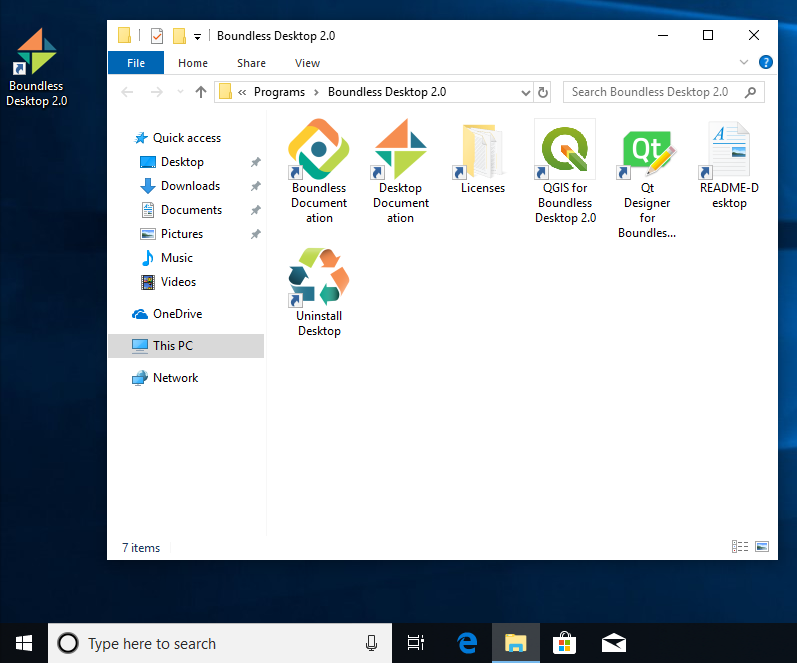
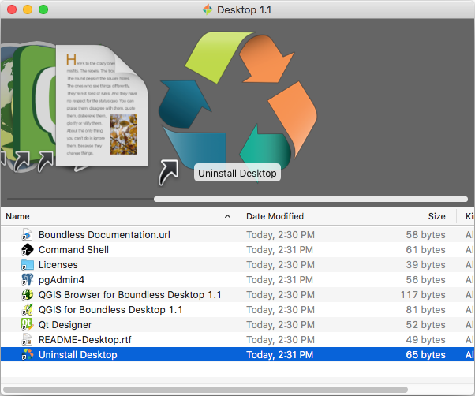

.. _install.uninstall:

Uninstalling Boundless Desktop
==============================

.. _install.uninstall.win:

Windows
-------

In windows, to uninstall Boundless Desktop |version| core apps, libs and
utilities and the symbolically linked applications and documentation, use the
`Uninstall Desktop` shortcut available in the Boundless Desktop shortcut
folder or from the start menu.

   Uninstall Desktop shortcut location

#. Double-click the shortcut to run the uninstaller (administrator
   permissions are required).

#. In the :guilabel:`User Account Control` dialog, click :guilabel:`YES`.

   .. figure:: img/install_uninstall_win_UAC_message.png

#. In the next dialog, press :guilabel:`Uninstall` to proceed with the
   uninstallation of Boundless Desktop from your computer.

   .. figure:: img/install_uninstall_win_dialog.png

      Boundless Desktop Uninstaller dialog

#. Once the process is finished, click :guilabel:`Close` to close the
   uninstaller window.
   
.. _install.uninstall.osx:

OS X
----

In Mac OS X, to uninstall the Boundless Desktop core apps, libs and
utilities, and the symbolically linked applications and documentation, use
the `Uninstall Desktop` shortcut available in the Boundless Desktop's
shortcuts folder (:menuselection:`Applications --> Boundless --> Desktop 1.1`).

   Uninstall Desktop shortcut location

#. Double-click the shortcut to run the uninstaller. Click
   :guilabel:`Uninstall` to start the uninstall procedure.

   .. figure:: img/install_uninstall_osx_administrator_permissions.png

      Uninstall Desktop shortcut location

#. Administrator permissions are required. Enter your administrator
   credentials to proceed with the uninstall.

   .. figure:: img/install_uninstall_osx_administrator_credentials.png

      Entering administrator's credentials

#. Once the uninstall is finished, a dialog will inform the user about what
   was removed. Click :guilabel:`Quit` to close it.

   .. figure:: img/install_uninstall_osx_complete.png

      Uninstallation complete

.. Note::

   Both in Windows and Mac OS X, all user's configuration and settings (for
   example, QGIS settings and plugins) will be preserved for future
   installations of `Boundless Desktop`.