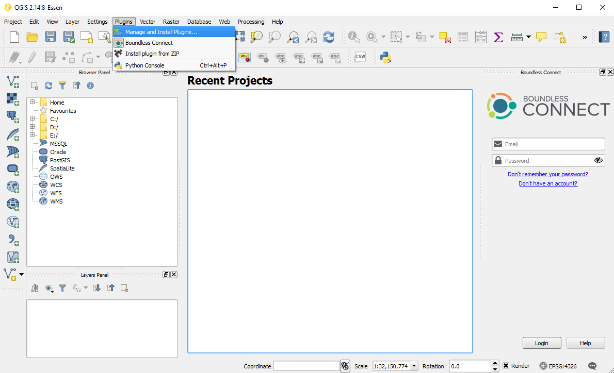
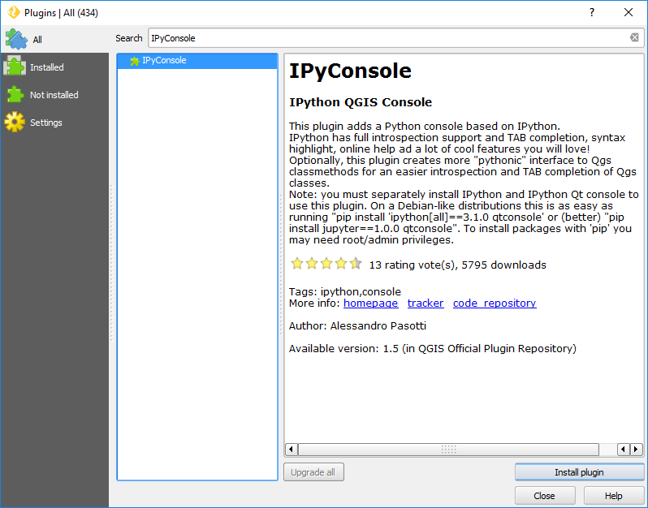

.. (c) 2016 Boundless, http://boundlessgeo.com
   This code is licensed under the GPL 2.0 license.

.. _install:

Installation
============

IPyConsole is available in the official QGIS Plugin repository and can
be installed using the plugin manager as any other plugin:

