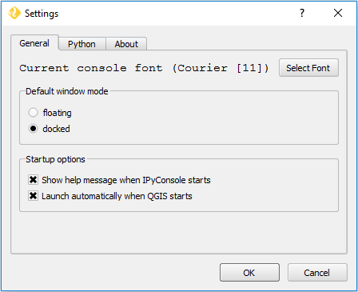
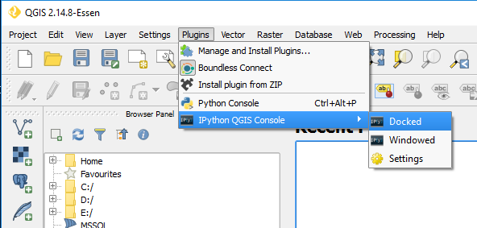
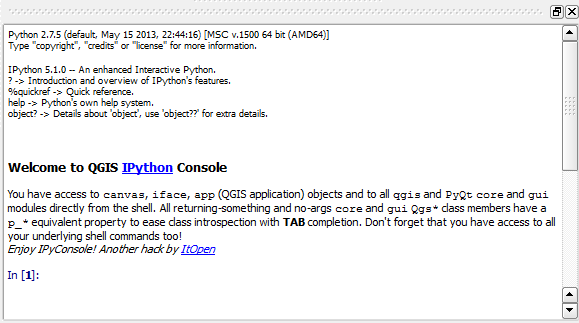
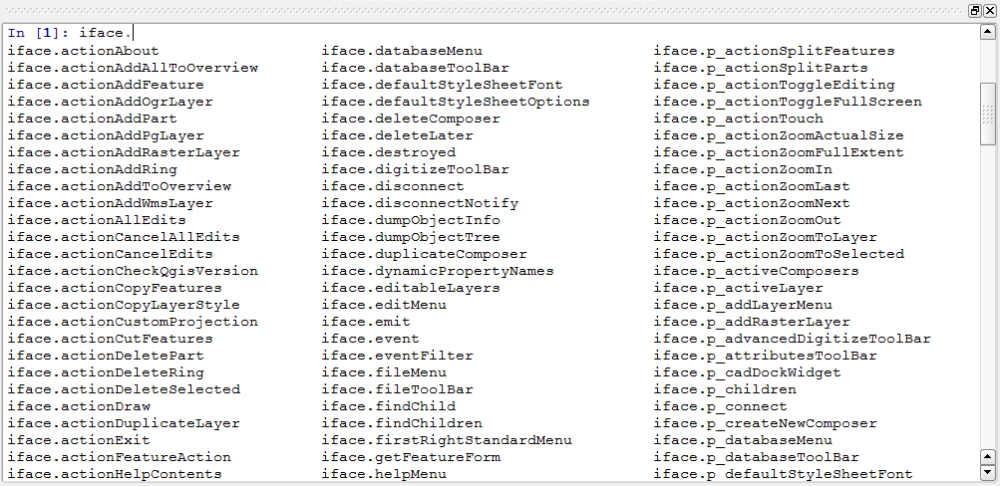
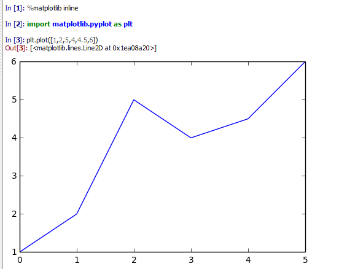
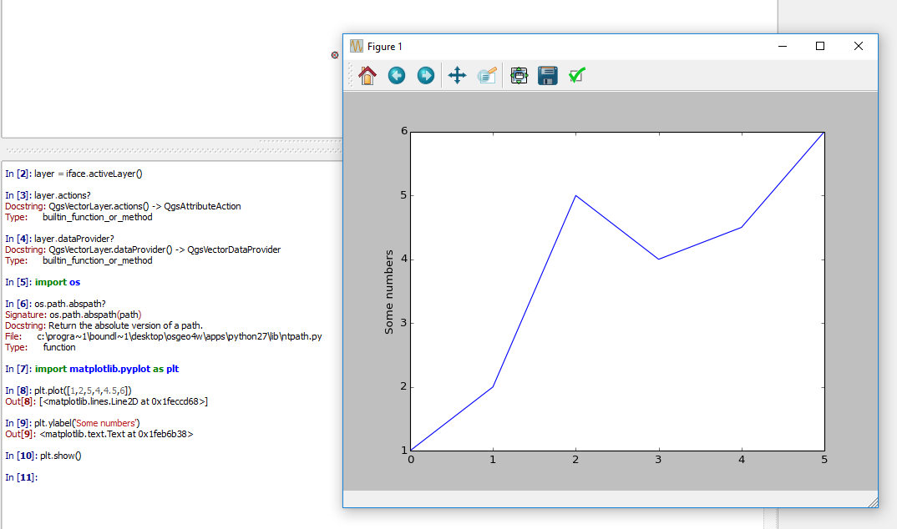

.. (c) 2016 Boundless, http://boundlessgeo.com
   This code is licensed under the GPL 2.0 license.

.. _usage:

Usage
===============================

This document contains usage examples of IPyConsole plugin.

Customizing IPyConsole
**********************

Font family and size can be customized as well as launch on QGIS start and
propertize.

Launching IPyConsole
*********************

IPyConsole can be launched:

* automatically when QGIS starts (see the option in the settings)
* by selecting the menu item in the plugins menu
* by clicking on the small icon that the plugin installs in the QGIS toolbar

Executing Python commands
*************************

Python commands can be entered like in the standard Python console.

TAB completion
**************
TAB-completion is extremely useful when importing modules, exploring the API or
even when loading files (TAB-completion also works on filesystem paths).

Inline graphs
**************

Matplotlib graphs can be shown inline or in a separate window.

Windowed graphs
***************

