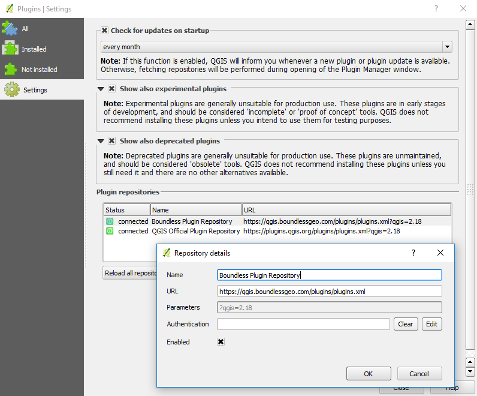

.. (c) 2016 Boundless, http://boundlessgeo.com
   This code is licensed under the GPL 2.0 license.

.. _boundless.plugins.repo:

Boundless QGIS Plugin Repository
================================

While most of our QGIS plugins are published on QGIS official plugin repository,
some are only available through Boundless own plugin repository (*e.g.*, Image
Discovery).

If you are using `QGIS for Boundless Desktop`, this repository is already
set, and its plugins will be listed in the plugin manager. Otherwise,
if you are using QGIS from one of the community's installers, you can setup the
repository in the `Plugin manager` by going to :menuselection:`Plugins -->
Manage and install plugins` and, in the :guilabel:`Settings` tab, add a new
repository with the following URL:

- https://qgis.boundlessgeo.com/plugins/plugins.xml

.. _official QGIS repository: http://plugins.qgis.org/
.. _Boundless connect plugin: http://boundlessgeo.github.io/qgis-plugins-documentation/connect/index.html

   Adding Boundless QGIS plugin repository

.. Note::

   On Windows operating systems, while trying to connect to the
   repository, you may get a **Unable To Get Local Issuer
   Certificate** error message, which will block the access the repository.
   To solve the issue, use your browser (Chrome, Edge or Internet
   Explorer) to open the `repository's URL
   <https://qgis.boundlessgeo.com/plugins/plugins.xml>`_.
   This operation will add the needed certificate to your Windows system.

Beta Repository
---------------

If you have signed up for access to the **Beta Plugin Repository**, you must
set it up to be able to download and install the latest beta versions of our
plugins.

To set the BETA repository, go to :menuselection:`Plugins -->
Manage and install plugins` and, in the :guilabel:`Settings` tab, add a new
repository, give the repository another name (e.g.
``Boundless Plugin Beta Repository``) and use the following URL:

- https://qgis-beta.boundlessgeo.com/plugins/plugins.xml

Looking for something else?
---------------------------

- Boundless plugins in the `QGIS official plugin repository <QGIS plugin repository_>`_
- Boundless `Plugins documentation`_

.. _QGIS plugin repository: http://plugins.qgis.org/search/?q=boundless
.. _Plugins documentation: http://boundlessgeo.github.io/qgis-plugins-documentation
