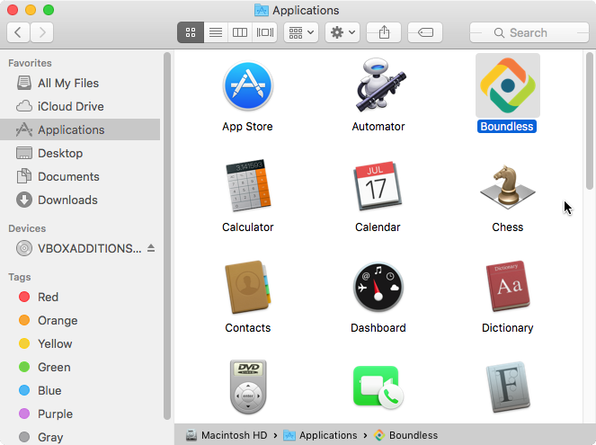
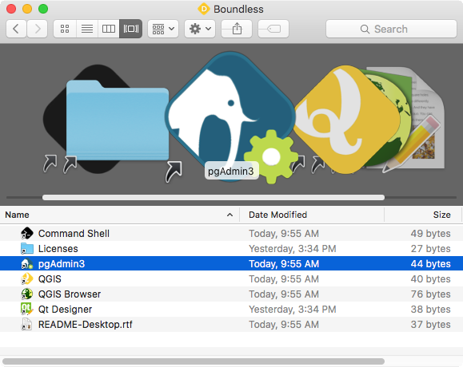

.. _quickstarguide:

Quick start guide
=================

Windows
-------

During installation, a desktop shortcut will be added for easy access to all installed tools. Double-click the icon to open the shortcuts folder. Then, simply double-click any of the icons to launch the desired tool.

.. figure:: img/quickstart_desktop_shortcut.png
   
   Boundless desktop shortcut and folder in windows
   
The same shortcuts are also added to the start menu in a group called `Boundless Desktop |version|`. Click on any of the tools icons or names to launch it.

.. figure:: img/quickstart_start_menu.png
   
   Boundless Desktop shortcuts group in the windows start menu

There is also an `Uninstall` shortcut to easily remove `Boundless Desktop` from your computer. Please see :ref:`install.uninstall` for more information about uninstalling procedures.

OS X
----

After installation, you will find a Boundless Desktop icon in the Applications folder.

   
   Boundless Desktop icon in Mac OS X Applications folder

Double-click the icon to open the shortcuts folder. Then, simply double-click any of the icons to launch the desired tool.

   
   Boundless desktop shortcuts folder in Mac OS X

In both Windows and Mac, there's a handy `Licenses` shortcut to access the licenses for each individual tool. Please make sure to consult those licenses, including Boundless EULA for Boundless desktop.

There is also a link to Boundless Desktop's README file, that provide valuable information about it.

For more information on how to use each tool, please see the :ref:`components` section.
