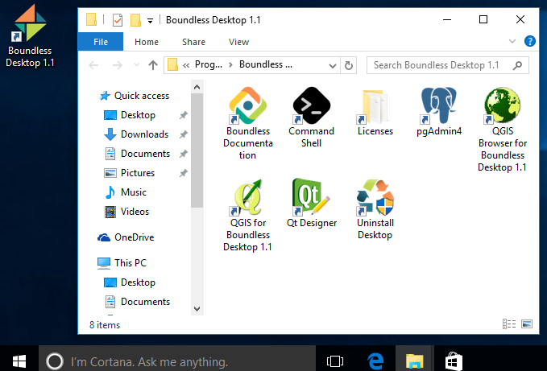
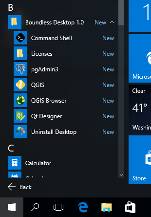

.. _quickstarguide:

Quick start guide
=================

Windows
-------

After installation, a Boundless Desktop shortcut is added for easy access to all
the installed tools. Double-click the icon to open the shortcuts folder. Then,
double-click any of the icons to launch the respective tools.

   Boundless desktop shortcut and folder in windows

The same shortcuts are also added to the start menu in a group called `Boundless
Desktop` |version|. Click on any of the tools' icons or names to launch it.

   Boundless Desktop shortcuts group in the windows start menu

There is also an `Uninstall` shortcut to easily remove `Boundless Desktop` from
your computer. Please see :ref:`install.uninstall` for more information about
uninstalling procedures.

.. note::

   Users should not 'pin' the launched apps to the Windows taskbar because the
   pinned icons will not launch the apps correctly next time.

.. commenting until future release for Mac OS

   Mac OS X
   --------

   After installation, you will find a Boundless icon in the *Applications* folder.

   .. figure:: img/quickstart_osx_apps_folder.png

      Boundless icon in Mac OS X Applications folder

   Double-clicking the Boundless icon will lead you to a folder with a *Desktop*
   |version| icon. Double-clicking it will open the Boundless Desktop's shortcuts
   folder. In it, double-click any of the icons to launch the respective tool.

   .. figure:: img/quickstart_osx_shortcut_folder.png

      Boundless desktop shortcuts folder in Mac OS X

   In both Windows and Mac, there's a handy `Licenses` shortcut to access the
   licenses for each individual tool. Please make sure to consult those licenses,
   including Boundless EULA for Boundless desktop.

   There is also a link to Boundless Desktop's README file, that provide valuable
   information about it.

   For more information on how to use each tool, please see the :ref:`components`
   section.
