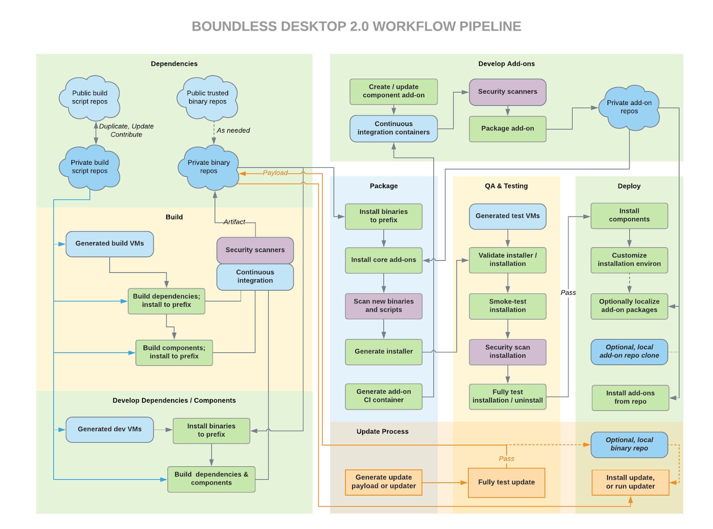

.. _what_is_boundless_desktop:

What is Boundless Desktop?
==========================

Boundless Desktop is the commercially-supported version of the open source QGIS
project and GIS toolkit, providing the ability to manage, analyze, and
disseminate your geospatial data under open standards without sacrificing the
security of an Enterprise solution. Powered by proven open source projects with
premier support, Boundless Desktop gives you the control and tools to unlock
your location-based data for maximum bottom-line impact.

Boundless Desktop |version| is composed of the following set of open source
tools:

Core
----

* :program:`QGIS 3.4` by http://www.qgis.org

  The well known leading Open Source GIS for desktop, QGIS, is a cross-platform
  desktop application for viewing, editing, and analysing geospatial data from a
  variety of (proprietary and open) vector, raster, and database formats.

* :program:`GDAL/OGR 2.3` by `<http://www.gdal.org>`_

  Geospatial Data Abstraction Library (GDAL/OGR) is a cross-platform C++
  translator library for raster and vector geospatial data formats, which
  supports over 50 raster formats, and OGR over 20 vector formats.

* :program:`Python 3.6` interpreter by `<http://www.python.org>`_ provided from
  https://www.anaconda.com/distribution/

  Object-oriented, interpreted, and interactive programming
  language,  it combines remarkable power with very clear syntax. Python is also
  usable as an extension language for applications written in other languages
  that need easy-to-use scripting or automation interfaces, which is the case of
  QGIS, which uses python as its backbone for scripting and plugin creation.

  Boundless Desktop uses Anaconda Python distribution, which gives access to
  hundreds of scientific and data management libraries (e.g., pandas, geopandas,
  r, and jupyter)

* :program:`Qt Designer 5.9` for QGIS by `<http://www.qt.io>`_

  Qt's Framework tool for designing and building graphical user interfaces
  (GUIs) from Qt components. With it, you can compose and customize widgets or
  dialogs in a what-you-see-is-what-you-get (WYSIWYG) manner, and also test them
  using different styles and resolutions. The tool has been extended with QGIS
  widgets (*e.g.*, project layer selector).

* :program:`PgAdmin 4 v3.?`` by `<http://www.pgadmin.org>`_ (Optional)

  Feature-rich Open Source administration and development platform
  for `PostgreSQL <https://www.postgresql.org/>`_, the most advanced Open Source
  database in the world, which includes, among others, the `Postgis
  <http://postgis.org/>`_ spatial extension.

* :ref:`Support tool <support_tool_plugin>` by Boundless

  QGIS plugin and python tool to collect information from the user's QGIS
  installation and system, to help in debugging. The information can be saved as
  a file or copied to the clipboard. See more details under the :ref:`plugins
  section <support_tool_plugin>`.

* ?!Mini conda?!

* Command Shell

  * IPython console
  * Jupyter console

* Offline Documentation (optional)

(See :ref:`components` section for more details on each component)

Core component dependencies
---------------------------

There are core dependencies that are provided for convenience, as they can be used
as QGIS processing provider adding hundreds of new tools.

* :program:`SAGA` by http://www.saga-gis.org/

  SAGA (System for Automated Geoscientific Analyses) is a GIS software that has
  been designed for an easy and effective implementation of spatial algorithms.
  It offers a comprehensive, growing set of geoscientific methods.

  In Boundless Desktop, SAGA GUI is not exposed, and it works exclusively as an
  extra provider for QGIS processing framework.

* :program:`GRASS` 7.4.2 by https://grass.osgeo.org/

  GRASS (Geographic Resources Analysis Support System), is a free and open
  source GIS software suite used for geospatial data management and analysis,
  image processing, graphics and maps production, spatial modeling, and visualization.

  In Boundless Desktop, SAGA GUI is not exposed, and it works exclusively as an
  extra provider for QGIS processing framework.

Plugins
-------

Boundless Desktop is also extended by a set of :ref:`Boundless-supported plugins
<qgis.plugins>` for QGIS. The plugins are aimed at improving QGIS functionality,
but also for better integration with other Boundless products, like
:server:`Boundless Server <>` and :exchange:`Boundless Exchange <>`.

**THE FIGURE MUST BE REDONE OR REMOVED**

.. figure:: img/boundless_desktop_simplified_ecosystem.png

   Boundless Desktop ecosystem

.. Commenting until necessary The central element of our QGIS installation is the
   :bd_plugins:`Boundless connect plugin <connect/1.1>`, which acts
   as a single entry point to Boundless technology and content for QGIS. This
   provides access to :connect:`Boundless Connect <>`
   content, which currently includes Boundless-supported plugins, basemaps,
   and knowledge-based content, like documentation, tutorials and lessons
   for lessons plugins.

Security
--------

- Full control of the source code provenance by fully building all binaries for
  all components and its dependencies.
- Security scans (Fortify, SonarQube, Dependency Checker) at multiple parts of
  the building pipeline.

**THE FIGURE NEEDS A SIMPLIFIED VERSION**

Testing and QA
--------------

Each Boundless Desktop release is smoke-tested ensuring broadly that the
software performs as expected.

Support
-------

Boundless Desktop is not composed solely of zeros and ones! It also comes with
the deep technical knowledge and immediate readiness of our experts. From
product maintenance to day-to-day online support, whatever are your needs,
there is a support plan suited for you (get more information
`here <https://boundlessgeo.com/boundless-desktop-gis-software-mapping-solutions/>`_).
