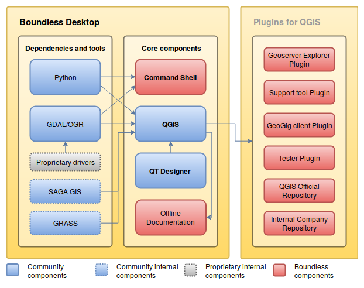

.. _what_is_boundless_desktop:

What is Boundless Desktop?
==========================

Boundless Desktop is a full-featured, professional desktop GIS that supports the management,
analysis, visualization and dissemination of your geospatial data. Powered by QGIS, a proven
open source geospatial software, Desktop combines innovative open source projects with
premier support, certiication and security, giving you the control and tools to unlock your
location-based data for maximum bottom-line impact.

Boundless Desktop |version| is composed of the following set of open source
tools:

* QGIS 3.4 by http://www.qgis.org
* PgAdmin 4 v3.? by `<http://www.pgadmin.org>`_
* Python 3.6.x by `<http://www.python.org>`_
* Qt Designer 5.9? for QGIS by `<http://www.qt.io>`_
* GDAL/OGR 2.3 by `<http://www.gdal.org>`_
* ??:ref:`Support tool <support_tool_plugin>` plugin by Boundless??

.. Connect plugin for QGIS by Boundless

QGIS is built using Anaconda Python distribution, which gives access to
hundreads of scientific and data management libraries (e.g., pandas, geopandas,
r, and jupyter)

Boundless Desktop is also extended by a set of Boundless-supported plugins for
QGIS. The plugins are aimed at improving QGIS functionality, but also for a better
integration with other Boundless products, like :server:`Boundless Server <>` and
:exchange:`Boundless Exchange <>`.

**THE FIGURE MUST BE REDONE OR REMOVED**

   Boundless Desktop ecosystem

.. Commenting until necessary The central element of our QGIS installation is the
   :bd_plugins:`Boundless connect plugin <connect/1.1>`, which acts
   as a single entry point to Boundless technology and content for QGIS. This
   provides access to :connect:`Boundless Connect <>`
   content, which currently includes Boundless-supported plugins, basemaps,
   and knowledge-based content, like documentation, tutorials and lessons
   for lessons plugins.

Security
--------

- Provenance of the code
- Secury scanning at three stages of the building and packaging process
- Security scans (Fortify, SonarQube, Dependency Checker) at multiple parts of the pipeline. 

.. figure:: https://github.com/boundlessgeo/desktop-documentation/blob/updates_BD2.0/docs/source/img/BD_2.0_pipeline.png

      

Testing and QA
--------------

Each Boundless Desktop release is smoke-tested ensuring broadly that the software performs as expected.

Support
-------

Boundless Desktop is not composed solely of zeros and ones! It also comes with
the deep technical knowledge and immediate readiness of Boundless experts. From
product maintenance and day-to-day online support, whatever are your needs,
there is a Boundless support plan suited for you (get more information `here <https://boundlessgeo.com/boundless-desktop-gis-software-mapping-solutions/>`_).
